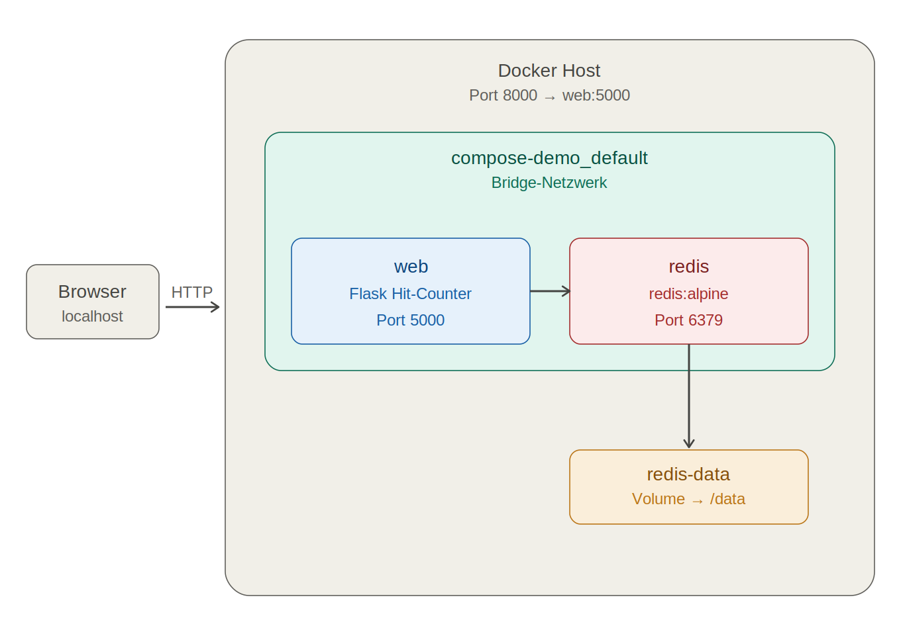

# Docker Compose – Auftrag

## 1. Diagramm und Container

**`web`** – Wird aus dem lokalen Dockerfile gebaut (Basis `python:3.12-alpine`). Führt die Flask-App `app.py` aus, die bei jedem `/`-Aufruf den Redis-Counter erhöht. Lauscht intern auf Port 5000, der via `8000:5000` auf den Host veröffentlicht wird. Startet dank `depends_on` mit `service_healthy` erst, sobald Redis bereit ist.

**`redis`** – Verwendet das offizielle Image `redis:alpine` direkt aus Docker Hub. Lauscht nur intern auf Port 6379 (kein Host-Mapping). Ein Healthcheck (`redis-cli ping`) signalisiert die Bereitschaft. Das benannte Volume `redis-data` wird auf `/data` gemountet und sorgt dafür, dass der Hit-Counter ein `docker compose down` überlebt.

## 2. Fragen

**Was ist Redis?**
Redis (Remote Dictionary Server) ist eine In-Memory-Datenbank, die Schlüssel-Wert-Paare im RAM speichert. Dadurch sind Lese- und Schreibzugriffe extrem schnell – ideal für Caches, Sessions, Warteschlangen oder einfache Zähler wie hier (`cache.incr("hits")`). Optional kann Redis seinen Zustand auf Disk persistieren, weshalb hier das Volume auf `/data` gemountet ist.

**Welche Ports werden genutzt?**

| Port | Wo                | Zweck                                                                      |
| ---- | ----------------- | -------------------------------------------------------------------------- |
| 8000 | Host              | Vom Browser erreichbar (`http://localhost:8000`), aus `APP_PORT` in `.env` |
| 5000 | Container `web`   | Flask-Standardport, im Dockerfile mit `EXPOSE` deklariert                  |
| 6379 | Container `redis` | Redis-Server, nur im Compose-Netzwerk sichtbar                             |

**Bedeutung von `ENV` im Dockerfile**
`ENV` setzt Umgebungsvariablen, die dauerhaft im Image gespeichert und in jedem daraus gestarteten Container verfügbar sind. Im Beispiel sagt `FLASK_APP=app.py` dem `flask`-Befehl, welche Datei die Anwendung enthält, und `FLASK_RUN_HOST=0.0.0.0` weist Flask an, auf allen Interfaces zu lauschen – sonst wäre der Server vom Host aus trotz Port-Mapping nicht erreichbar. Im Gegensatz zu Werten aus `environment:` in `compose.yaml` sind `ENV`-Variablen Teil des Images, können aber zur Laufzeit überschrieben werden.
